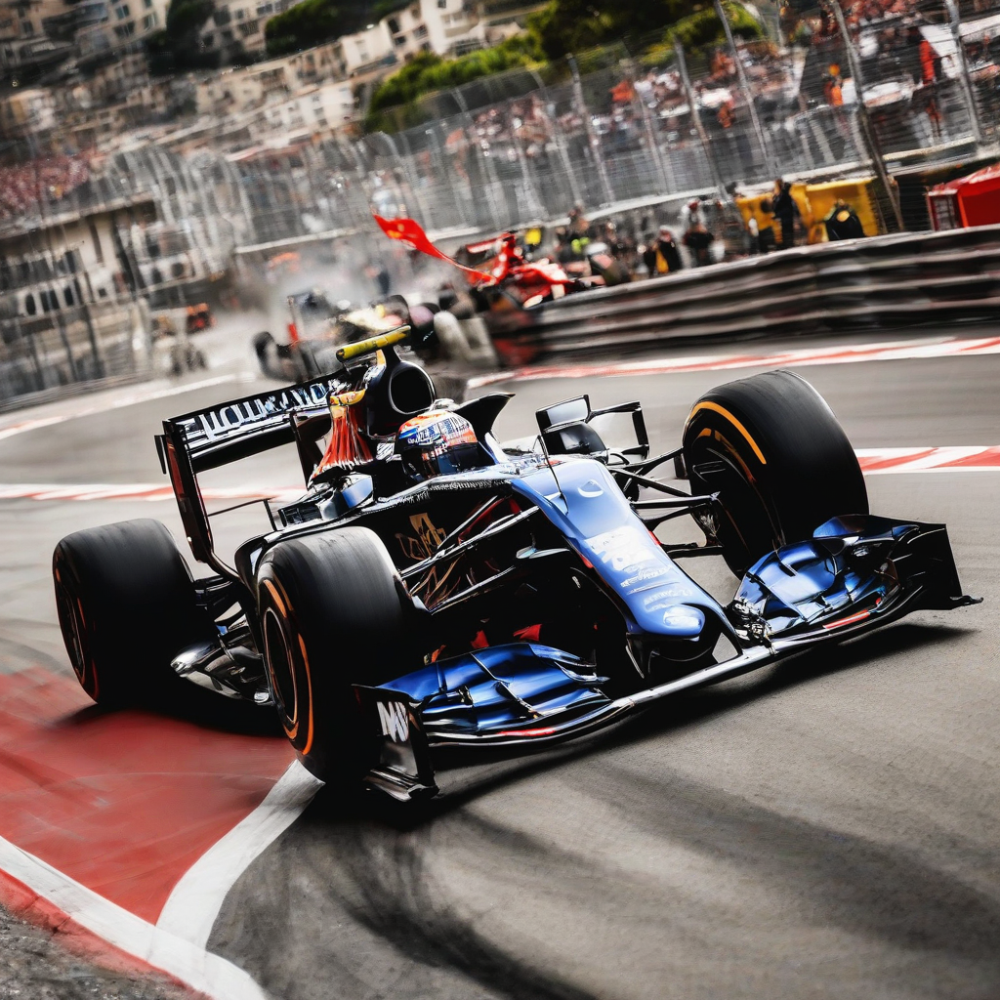

Title: "Checkered Flag Madness Unfolds at Monaco Grand Prix"
Date: 2024-09-07 21:21
Category: autosports

> This article is AI generated!
> 
> Title and text are generated with @cf/meta/llama-3.1-8b-instruct
> 
> Image is generated with @cf/stabilityai/stable-diffusion-xl-base-1.0
> 
> [Check out Cloudflare Workers AI](https://developers.cloudflare.com/workers-ai/models/)

The highly anticipated Monaco Grand Prix has come to an end, and the drama that unfolded on the streets of Monte Carlo will be remembered for a long time. The track, notorious for its tight turns and breathtaking scenery, proved to be a challenging course for even the most seasoned drivers. After a grueling two hours of racing, the checkered flag waved, signaling the conclusion of the event. In a surprising turn of events, Max Verstappen emerged victorious, crossing the finish line a mere 1.3 seconds ahead of his fierce competitor, Charles Leclerc.