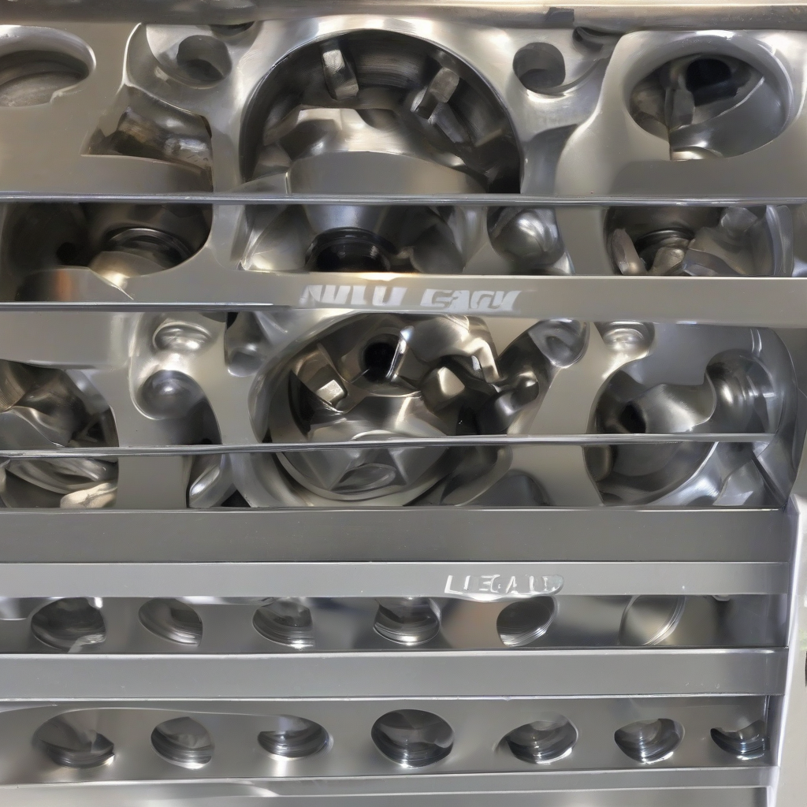

Title: Lug nut Legacy
Date: 2024-09-07 14:21
Category: daily joke

> This article is AI generated!
> 
> Title and text are generated with @cf/meta/llama-3.1-8b-instruct
> 
> Image is generated with @cf/stabilityai/stable-diffusion-xl-base-1.0
> 
> [Check out Cloudflare Workers AI](https://developers.cloudflare.com/workers-ai/models/)

The humble lug nut, a small but essential component of our vehicle's safety and stability, has a rich history that spans over a century. From its early days as a simple metal fastener to its current advanced designs, the lug nut has evolved to provide a secure and reliable connection between our tires and wheels. The first lug nuts were introduced in the early 1900s, with early adopters using them to secure wheels on early automobiles. As the automotive industry expanded, so did the design and functionality of lug nuts, with advancements in materials, coatings, and thread patterns.