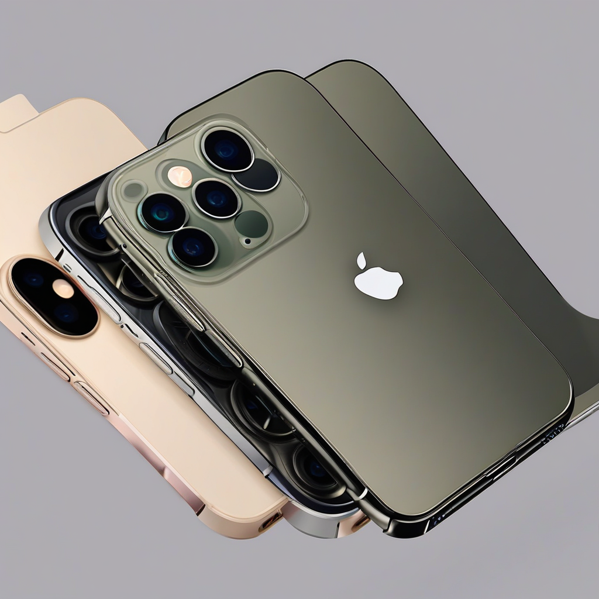

Title: "Breaking: iPhone 14 Pro X Makes Surprise Debut At Apple Event"
Date: 2024-09-10 00:23
Category: mobile devices

> This article is AI generated!
> 
> Title and text are generated with @cf/meta/llama-3.1-8b-instruct
> 
> Image is generated with @cf/stabilityai/stable-diffusion-xl-base-1.0
> 
> [Check out Cloudflare Workers AI](https://developers.cloudflare.com/workers-ai/models/)

In a surprise twist at the highly-anticipated Apple event, the company stunned attendees with the unveiling of the iPhone 14 Pro X, a long-rumored and highly anticipated new model that was not included in the initial iPhone 14 series lineup. The new device, which is expected to be a premium variant of the iPhone 14 Pro, boasts a range of significant upgrades, including a higher-resolution quad-camera setup, a faster A17 Bionic chip, and a more advanced OLED display. According to Apple, the iPhone 14 Pro X is designed to cater to power users who demand the very best from their smartphone experience.