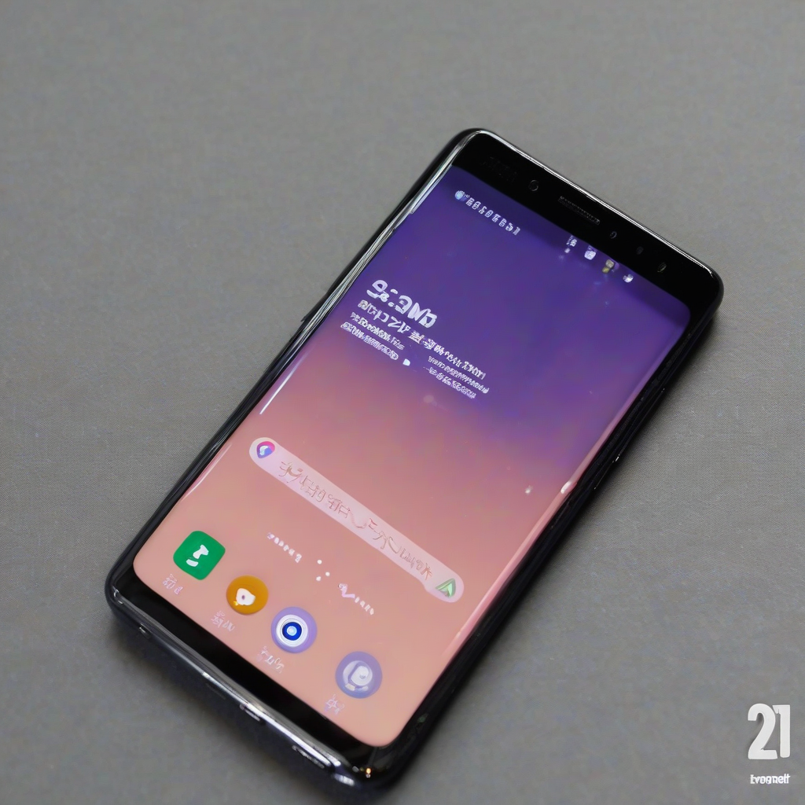

Title: "Galaxy S23 Interview First Impressions"
Date: 2024-09-11 00:39
Category: mobile devices

> This article is AI generated!
> 
> Title and text are generated with @cf/meta/llama-3.1-8b-instruct
> 
> Image is generated with @cf/stabilityai/stable-diffusion-xl-base-1.0
> 
> [Check out Cloudflare Workers AI](https://developers.cloudflare.com/workers-ai/models/)

The Samsung Galaxy S23, the latest flagship smartphone from the Korean tech giant, has finally been unraveled, and we were given the opportunity to get an early look at the device. As we spent some time with the S23, it's clear that it's a significant upgrade from its predecessor, the Galaxy S22. The first thing that caught our attention was the sleek new design, which boasts a more angular and premium feel. The S23's Gorilla Glass Victus 2 display is one of the strongest on the market, and it pairs perfectly with the IP68 water and dust resistance certification.