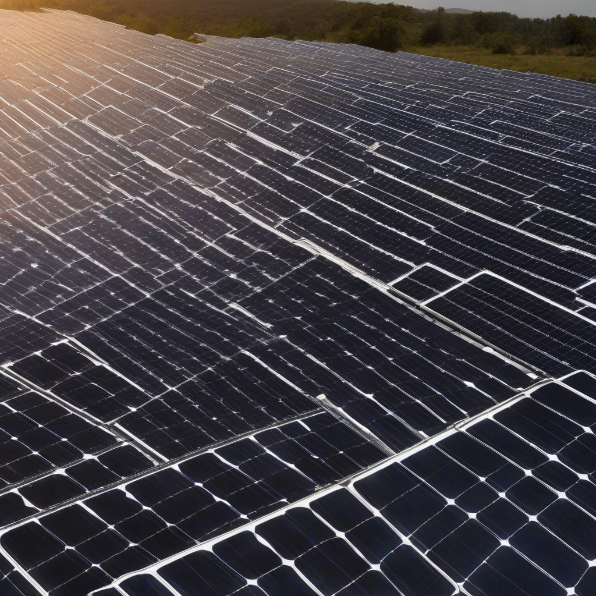

Title: "Solar Sector Sees Sudden Surge"
Date: 2024-09-11 07:39
Category: green energy

> This article is AI generated!
> 
> Title and text are generated with @cf/meta/llama-3.1-8b-instruct
> 
> Image is generated with @cf/stabilityai/stable-diffusion-xl-base-1.0
> 
> [Check out Cloudflare Workers AI](https://developers.cloudflare.com/workers-ai/models/)

The solar sector has experienced a significant surge in recent months, with many experts attributing the trend to increased investment in renewable energy and decreasing costs in solar panel technology. According to a recent report, global solar energy capacity reached a record high in 2022, with over 140 gigawatts of new installations added worldwide. This surge has been driven in part by falling solar panel prices, which have dropped by as much as 70% over the past decade, making renewable energy a more feasible and cost-effective option for homes and businesses.