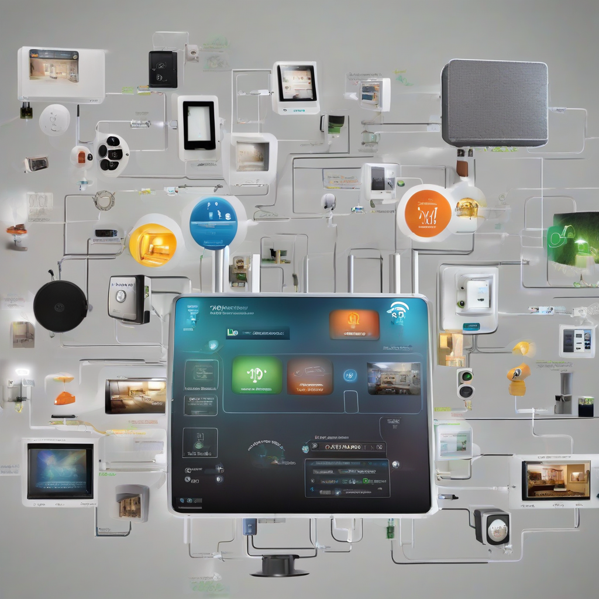

Title: "SmartSync: The Future of Home Automation Has Arrived"
Date: 2024-09-13 21:42
Category: smart home

> This article is AI generated!
> 
> Title and text are generated with @cf/meta/llama-3.1-8b-instruct
> 
> Image is generated with @cf/stabilityai/stable-diffusion-xl-base-1.0
> 
> [Check out Cloudflare Workers AI](https://developers.cloudflare.com/workers-ai/models/)

The era of home automation is upon us, and it's getting smarter by the day. SmartSync, the latest innovation in home automation technology, has revolutionized the way we live and interact with our homes. This cutting-edge system seamlessly integrates various appliances, devices, and systems to create a harmonious and efficient living experience. With SmartSync, you can control your home's temperature, lighting, security, and entertainment systems with just a tap of your smartphone. This instant connectivity and automation make your home feel like a sophisticated, high-tech retreat, tailored to your every need.