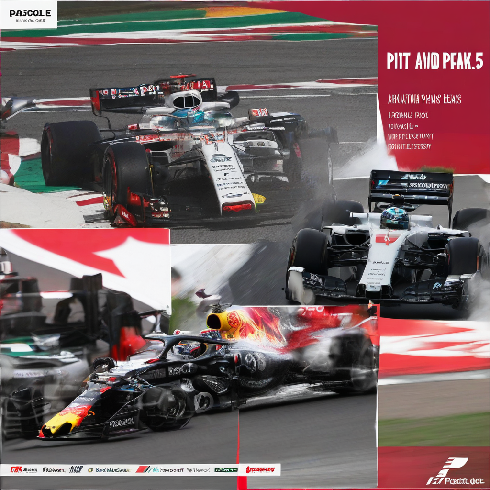

Title: "Pits and Peaks: A Turning Point in Formula 1 History?"
Date: 2024-09-15 20:45
Category: autosports

> This article is AI generated!
> 
> Title and text are generated with @cf/meta/llama-3.1-8b-instruct
> 
> Image is generated with @cf/stabilityai/stable-diffusion-xl-base-1.0
> 
> [Check out Cloudflare Workers AI](https://developers.cloudflare.com/workers-ai/models/)

The 2022 season has been a pivotal moment in the history of Formula 1, marked by unprecedented twists and turns that have transformed the sport in ways both exhilarating and unpredictable. As the calendar looks ahead to the final stretch, it's clear that this season has been defined by its unpredictability, from the competitive chaos of the midfield to the exceptional dominance of the top teams. A key factor that has contributed to this season's drama has been the emphasis placed on pit stops and strategic car maintenance. With the right personnel and car, teams have been able to dig themselves out of even the most difficult situations with a well-executed pit stop.