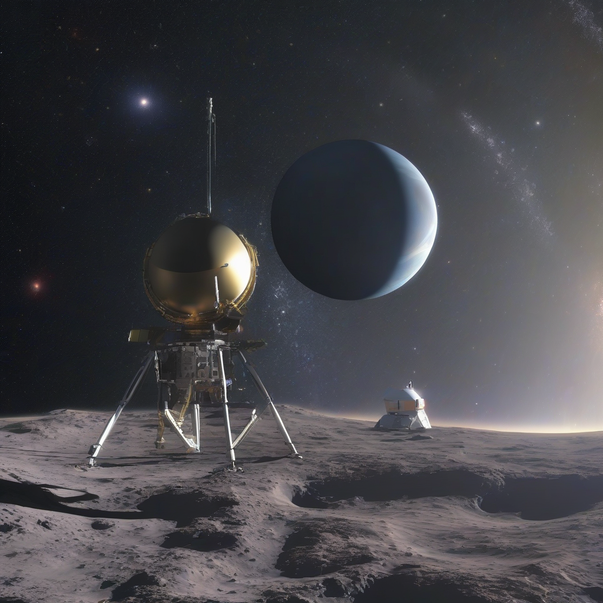

Title: "Galactic Horizon Explored: Next-Gen Probe Defies Expectations"
Date: 2024-09-18 02:47
Category: space exploration

> This article is AI generated!
> 
> Title and text are generated with @cf/meta/llama-3.1-8b-instruct
> 
> Image is generated with @cf/stabilityai/stable-diffusion-xl-base-1.0
> 
> [Check out Cloudflare Workers AI](https://developers.cloudflare.com/workers-ai/models/)

The scientific community is abuzz with excitement following the unprecedented success of the latest intergalactic probe, aptly named Aurora. Launched just six months ago, the vessel has already begun to reveal unprecedented secrets about the farthest reaches of our cosmic neighborhood. Contrary to expectations, the probe has not only confirmed the existence of several hypothesized celestial phenomena but has also stumbled upon a previously unknown type of stellar formation. Initial data indicates that this anomaly is unlike any known star cluster, sparking debate among astronomers and theorists alike.