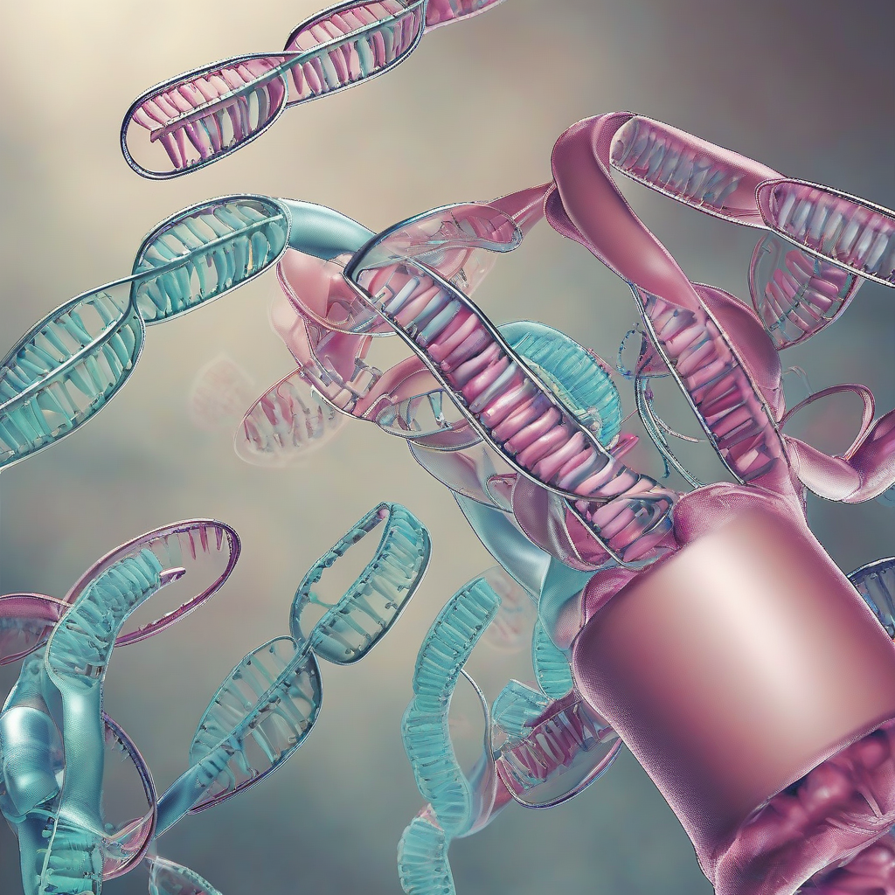

Title: "Breakthrough Gene Editing Technique Raises Ethical Concerns"
Date: 2024-09-19 03:49
Category: biotech

> This article is AI generated!
> 
> Title and text are generated with @cf/meta/llama-3.1-8b-instruct
> 
> Image is generated with @cf/stabilityai/stable-diffusion-xl-base-1.0
> 
> [Check out Cloudflare Workers AI](https://developers.cloudflare.com/workers-ai/models/)

A revolutionary breakthrough in gene editing has left the scientific community abuzz, but is also sparking heated debates about ethics and potential consequences. The new technique, developed by a team of researchers, uses a unique combination of CRISPR-Cas9 and machine learning to edit genes with unprecedented precision and speed. The technology has the potential to cure genetic diseases, reduce the need for invasive surgeries, and even enable scientists to alter inherited traits. However, experts warn that this new technology also raises crucial questions about the responsible use of such powerful tools.