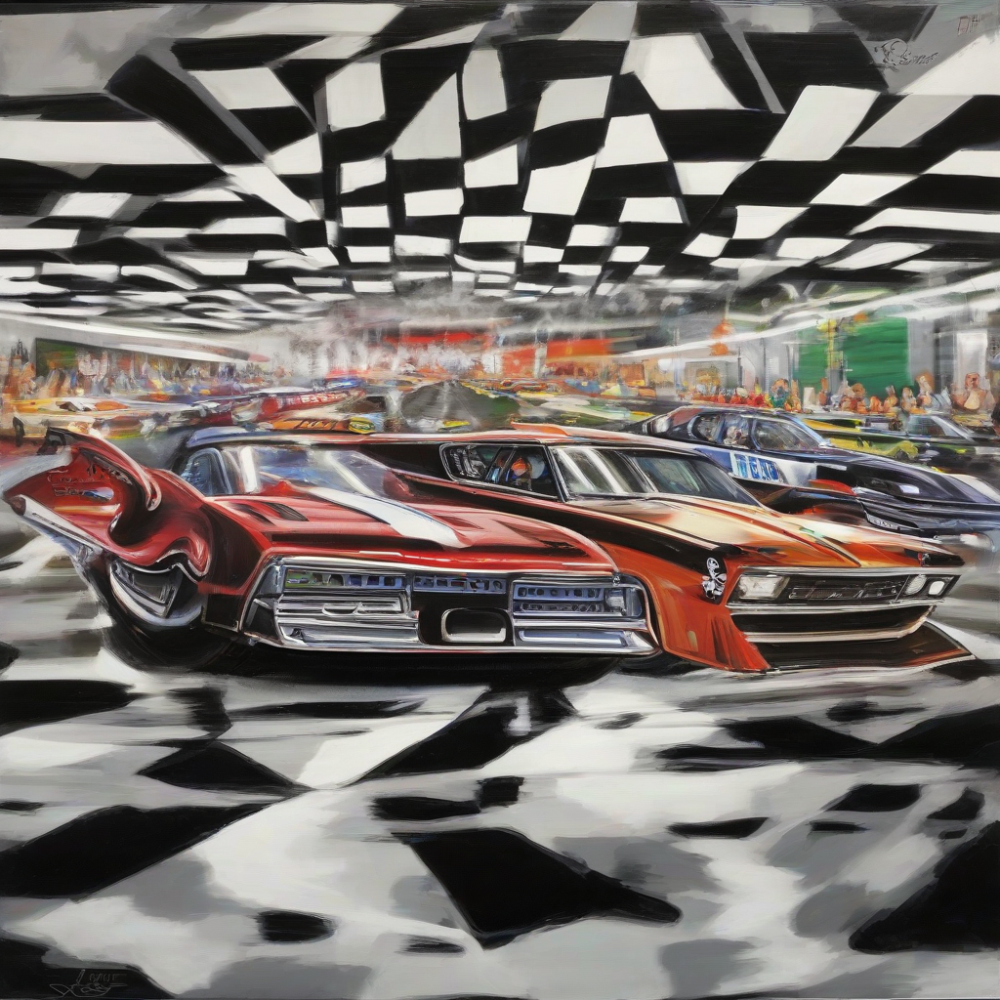

Title: "Fast Lane Frenzy"
Date: 2024-09-20 12:50
Category: autosports

> This article is AI generated!
> 
> Title and text are generated with @cf/meta/llama-3.1-8b-instruct
> 
> Image is generated with @cf/stabilityai/stable-diffusion-xl-base-1.0
> 
> [Check out Cloudflare Workers AI](https://developers.cloudflare.com/workers-ai/models/)

In the world of high-performance driving, the term "fast lane" has taken on a whole new meaning. Gone are the days of merely cruising down the highway at a leisurely pace. Today, the fast lane is synonymous with adrenaline-fueled rush of speed, precision handling, and a commitment to pushing the limits of what's possible. Whether it's on the track or on the open road, the driving experience has never been more exhilarating. With the latest innovations in car design and technology, drivers can now experience the thrill of high-speed driving like never before.