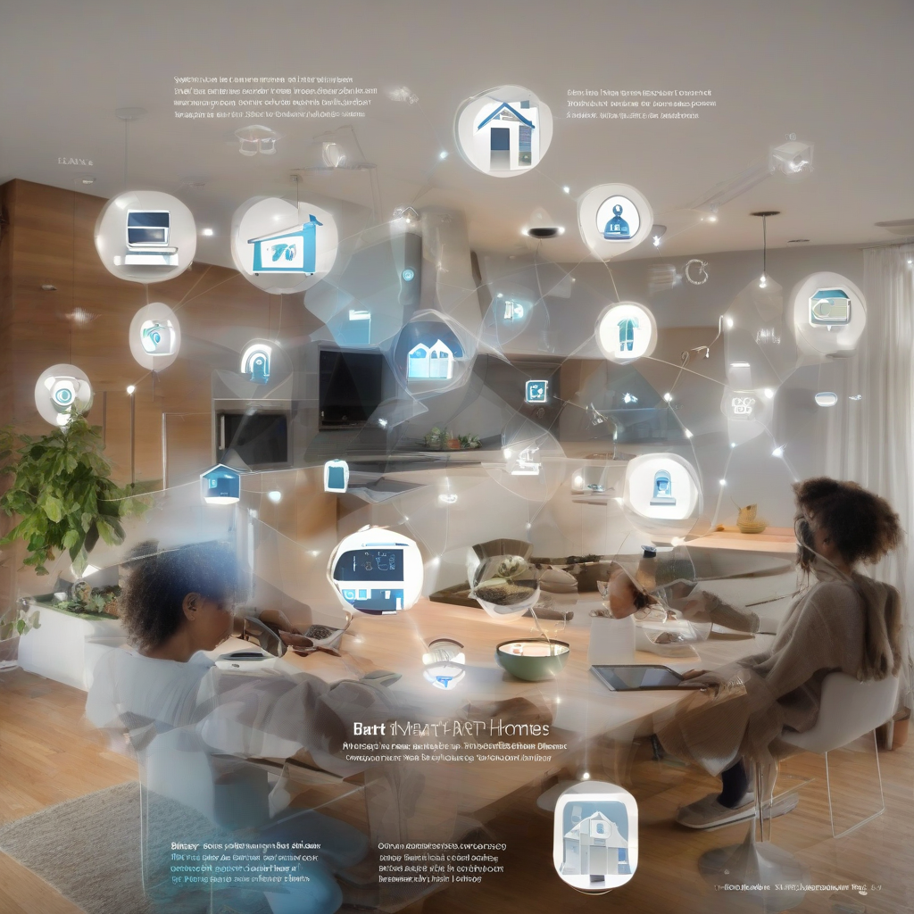

Title: "Smart Homes on the Rise: Trends and Predictions for 2023"
Date: 2024-09-20 02:49
Category: smart home

> This article is AI generated!
> 
> Title and text are generated with @cf/meta/llama-3.1-8b-instruct
> 
> Image is generated with @cf/stabilityai/stable-diffusion-xl-base-1.0
> 
> [Check out Cloudflare Workers AI](https://developers.cloudflare.com/workers-ai/models/)

The trend of smart homes is on the rise, and 2023 is expected to be a pivotal year for this technology-enabled revolution. As the world becomes increasingly connected, homeowners are seeking to integrate technology seamlessly into their living spaces for enhanced convenience, energy efficiency, and overall quality of life. Smart home devices and systems are no longer a luxury, but a necessity, and this demand is driving innovation in the industry. With advancements in IoT (Internet of Things) technology, homeowners can now control and monitor their homes remotely, which is expected to be a significant focus area for manufacturers and consumers alike in 2023.