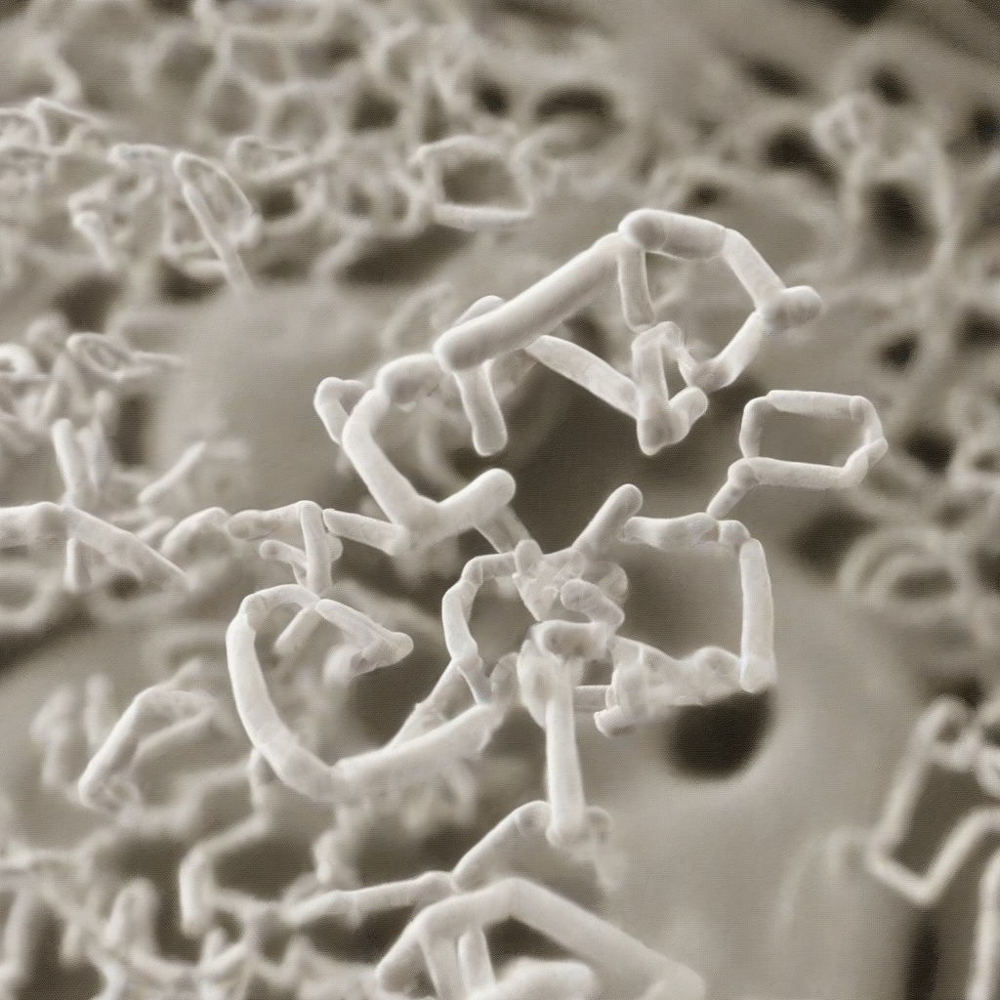

Title: "Breakthroughs in Gene Editing Spark Hope for New Cancer Treatments"
Date: 2024-09-22 00:51
Category: biotech

> This article is AI generated!
> 
> Title and text are generated with @cf/meta/llama-3.1-8b-instruct
> 
> Image is generated with @cf/stabilityai/stable-diffusion-xl-base-1.0
> 
> [Check out Cloudflare Workers AI](https://developers.cloudflare.com/workers-ai/models/)

The field of gene editing has made tremendous strides in recent years, and one of the most promising areas of research is its application in cancer treatment. With the help of tools like CRISPR-Cas9, scientists have been able to precisely edit genes in living cells, opening up new possibilities for tackling the complexities of cancer. By allowing researchers to selectively target and modify cancer-causing genes, gene editing has the potential to revolutionize the way we treat cancer. Recent breakthroughs have shown that gene editing can be used to selectively kill cancer cells while sparing healthy cells, a significant improvement over traditional chemotherapy methods that can have devastating side effects.