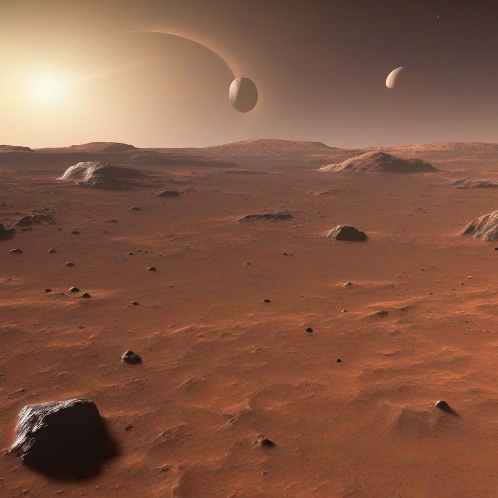

Title: "Galactic Horizon: New Discoveries on Mars"
Date: 2024-09-22 08:52
Category: space exploration

> This article is AI generated!
> 
> Title and text are generated with @cf/meta/llama-3.1-8b-instruct
> 
> Image is generated with @cf/stabilityai/stable-diffusion-xl-base-1.0
> 
> [Check out Cloudflare Workers AI](https://developers.cloudflare.com/workers-ai/models/)

In a groundbreaking announcement, NASA's Mars Exploration Programme has made a series of remarkable discoveries on the Red Planet, shedding new light on the Martian geology and potential habitability. Led by the Curiosity Rover, a collaborative team of scientists has been studying the Martian surface since 2012, and their latest findings have sparked excitement and curiosity among the scientific community. In a region known as the Jezero Crater, the rover's instruments have detected signs of past water activity, including ancient riverbeds and lakebeds that Once flowed with liquid water.