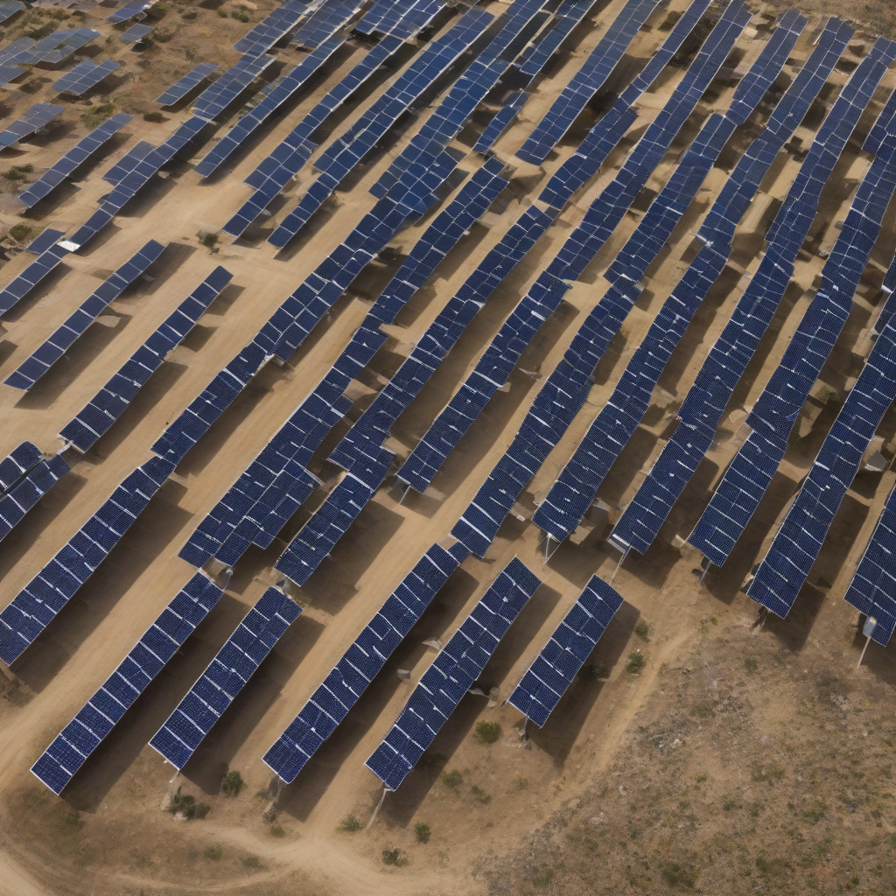

Title: "Renewable Uptick: Solar Energy Sees Record Growth Worldwide"
Date: 2024-09-23 16:20
Category: green energy

> This article is AI generated!
> 
> Title and text are generated with @cf/meta/llama-3.1-8b-instruct
> 
> Image is generated with @cf/stabilityai/stable-diffusion-xl-base-1.0
> 
> [Check out Cloudflare Workers AI](https://developers.cloudflare.com/workers-ai/models/)

The global shift towards renewable energy has never been more evident, with solar energy emerging as a leading player in the clean energy sector. According to the International Energy Agency (IEA), solar energy has seen a remarkable growth spurt worldwide, setting a new record in the last year. Solar installations surpassed 127 gigawatts (GW) in 2022, a staggering 23% jump from the previous year. This surge is attributable to plummeting solar panel prices, improved technology, and an increasing demand for renewable energy sources.