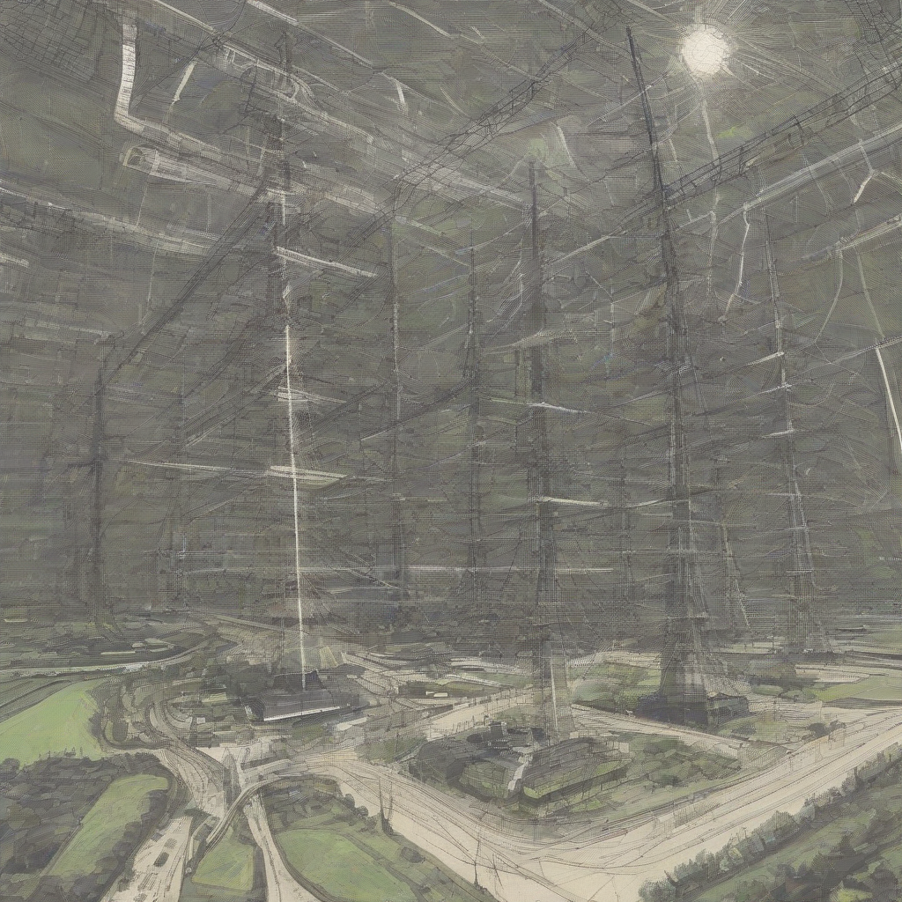

Title: "Renewable Revolution"
Date: 2024-09-24 03:21
Category: green energy

> This article is AI generated!
> 
> Title and text are generated with @cf/meta/llama-3.1-8b-instruct
> 
> Image is generated with @cf/stabilityai/stable-diffusion-xl-base-1.0
> 
> [Check out Cloudflare Workers AI](https://developers.cloudflare.com/workers-ai/models/)

The world is on the cusp of a revolution in the way energy is produced and consumed. Renewable energy sources, such as solar, wind, and hydroelectric power, are increasingly becoming the preferred choice for many countries, companies, and individuals. As the climate crisis continues to worsen, the need for sustainable and clean energy has become a pressing global priority. In order to combat climate change, reduce greenhouse gas emissions, and ensure a sustainable future, the world is turning to renewable energy as the solution.