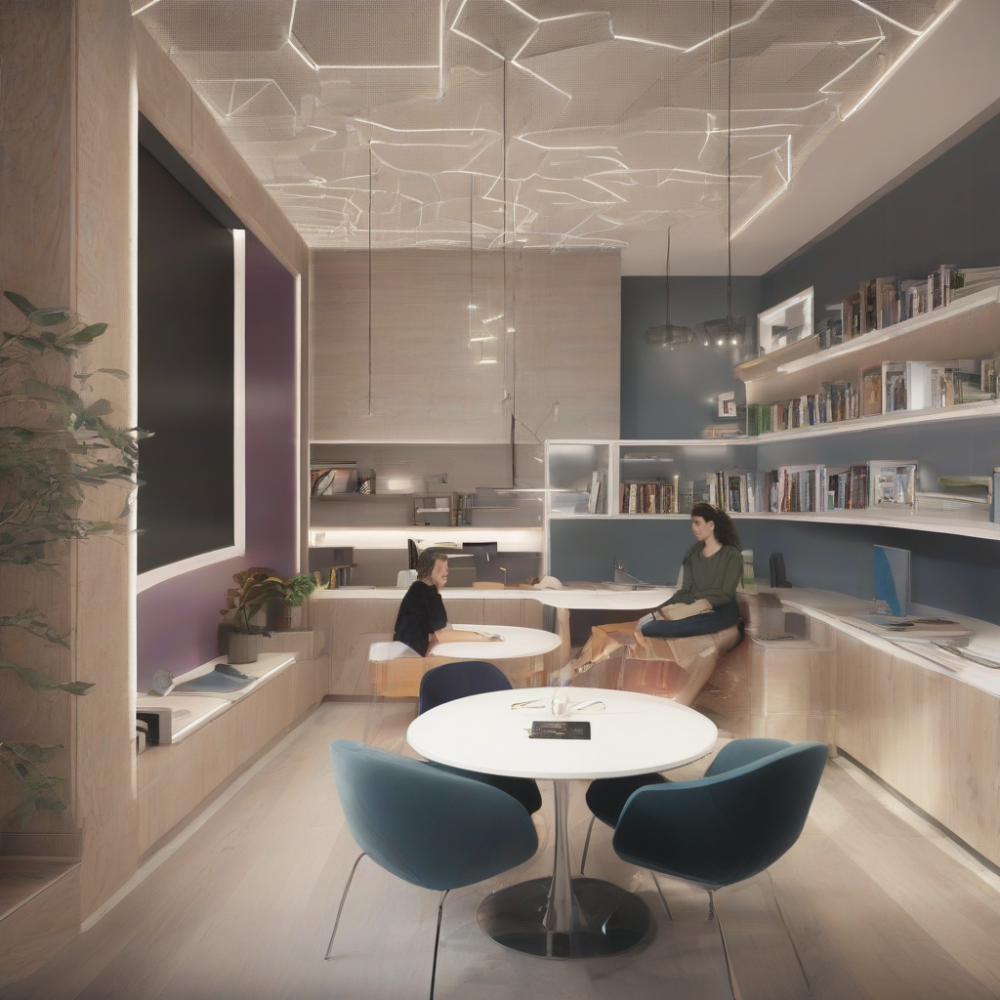

Title: "Smart Spaces"
Date: 2024-09-25 02:22
Category: smart home

> This article is AI generated!
> 
> Title and text are generated with @cf/meta/llama-3.1-8b-instruct
> 
> Image is generated with @cf/stabilityai/stable-diffusion-xl-base-1.0
> 
> [Check out Cloudflare Workers AI](https://developers.cloudflare.com/workers-ai/models/)

The concept of smart spaces is transforming the way we live and work. Smart spaces are not just buildings or offices, but rather intelligent, technology-enabled environments that respond to our needs and preferences. From smart homes to smart offices, smart spaces are equipped with advanced sensors, automation systems, and data analytics to create a more comfortable, efficient, and productive space. With smart spaces, the boundaries between technology and life are blurred, and individuals can enjoy a seamless experience that enhances their daily lives.