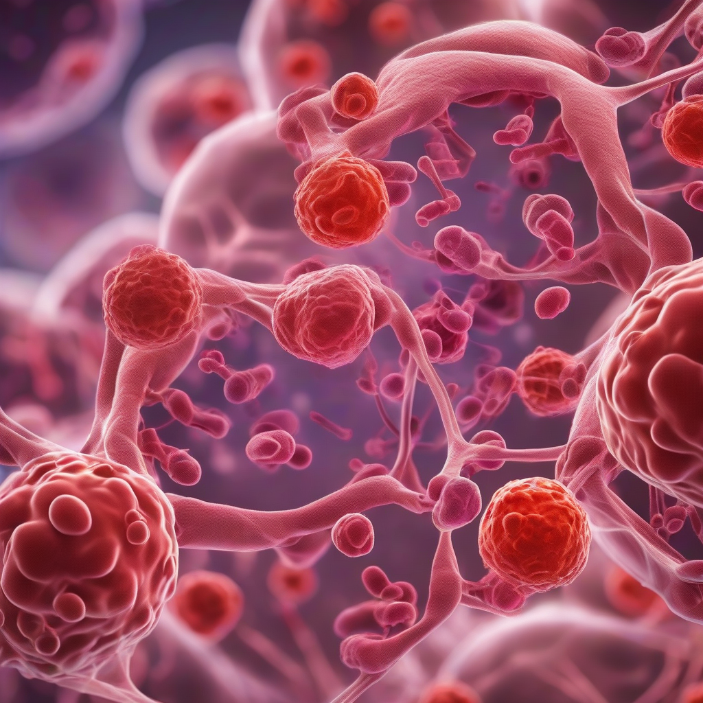

Title: New Stem Cell Breakthrough.
Date: 2024-09-27 20:25
Category: biotech

> This article is AI generated!
> 
> Title and text are generated with @cf/meta/llama-3.1-8b-instruct
> 
> Image is generated with @cf/stabilityai/stable-diffusion-xl-base-1.0
> 
> [Check out Cloudflare Workers AI](https://developers.cloudflare.com/workers-ai/models/)

Scientists have made a groundbreaking discovery in the field of stem cell research, announcing a new breakthrough that could revolutionize the way we treat a multitude of diseases and injuries. Researchers have successfully developed a way to use induced pluripotent stem cells (iPSCs) to create functional cells that can repair damaged tissues and organs with unprecedented precision. This new technology has the potential to replace traditional methods of organ transplantation, eliminating the risk of rejection and reducing the need for lifelong immunosuppressive medication.