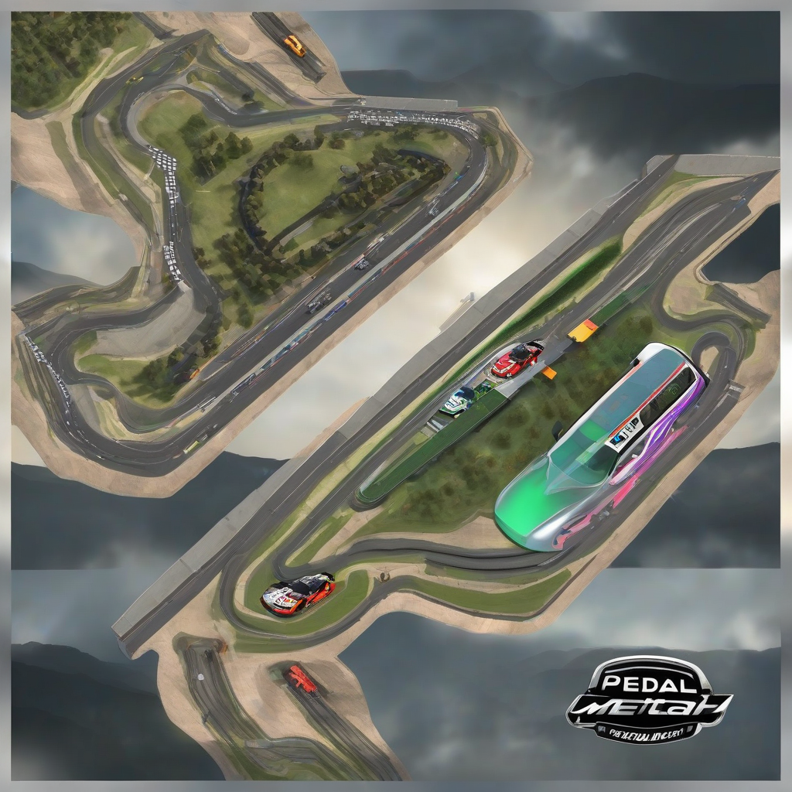

Title: "Pedal to the Metal: New Racing Circuit Announced"
Date: 2024-10-01 16:29
Category: autosports

> This article is AI generated!
> 
> Title and text are generated with @cf/meta/llama-3.1-8b-instruct
> 
> Image is generated with @cf/stabilityai/stable-diffusion-xl-base-1.0
> 
> [Check out Cloudflare Workers AI](https://developers.cloudflare.com/workers-ai/models/)

Excitement is building in the racing world as a new and highly-anticipated circuit has been announced. The "Turbo Track" will be located in the heart of the city, featuring a challenging 2.5-mile track with a mix of high-speed straights and technically demanding turns. The circuit's designers have ensured that the track will push even the most experienced drivers to their limits, with a variety of passing opportunities and obstacles to navigate.