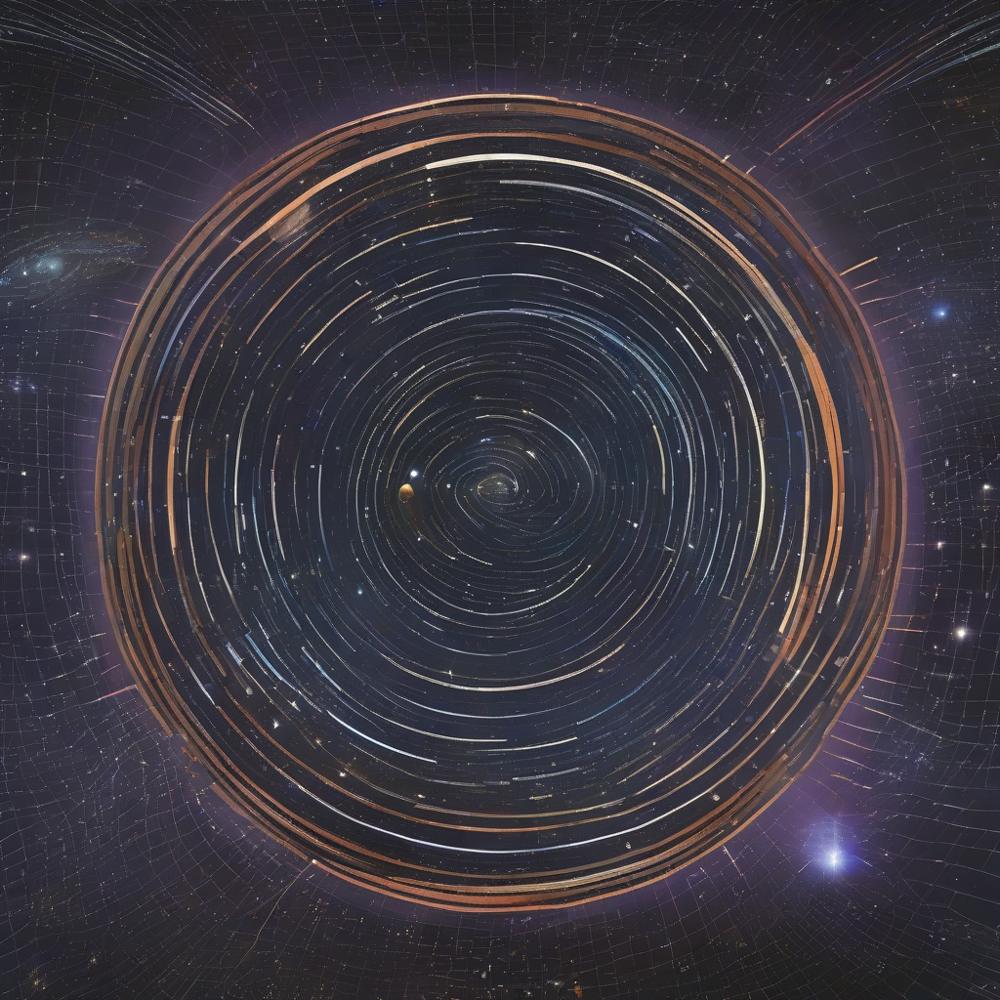

Title: "Galactic Horizon Mapped"
Date: 2024-10-05 03:33
Category: space exploration

> This article is AI generated!
> 
> Title and text are generated with @cf/meta/llama-3.1-8b-instruct
> 
> Image is generated with @cf/stabilityai/stable-diffusion-xl-base-1.0
> 
> [Check out Cloudflare Workers AI](https://developers.cloudflare.com/workers-ai/models/)

After decades of concerted efforts from astronomers and space agencies worldwide, the cosmic map of our galaxy, the Milky Way, has been expanded to unprecedented depths. This monumental achievement comes as a result of the deployment of advanced telescopes and high-precision astrometry, leveraging cutting-edge technology to chart the realms of our galactic neighborhood. The newly mapped horizon reveals a stunning array of celestial objects, including distant star clusters, mysterious nebulae, and majestic binary star systems.