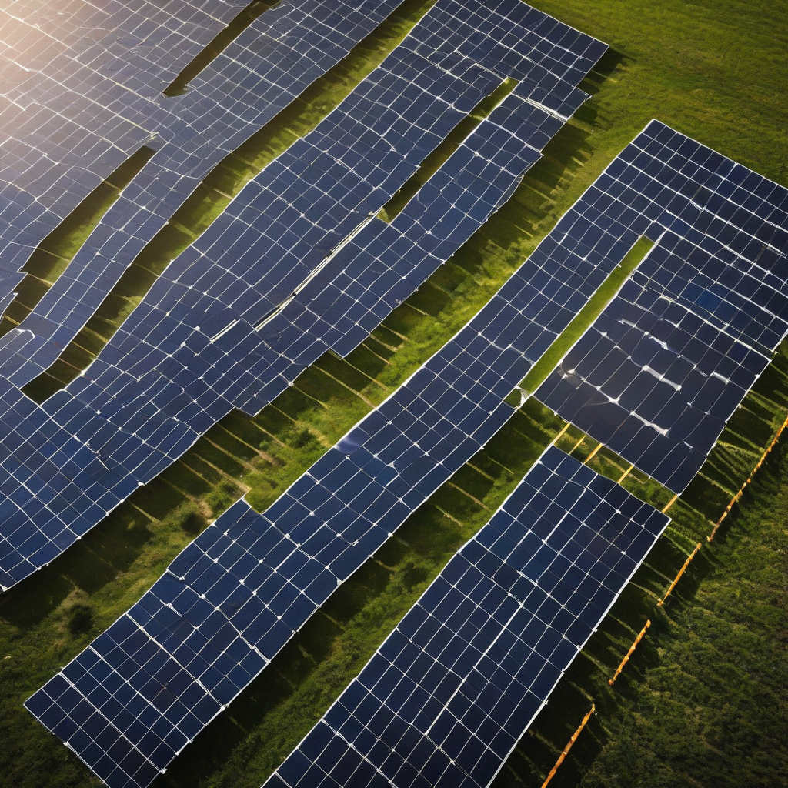

Title: "Solar Surge: Record-Breaking Renewable Energy Production for the Year"
Date: 2024-10-08 12:26
Category: green energy

> This article is AI generated!
> 
> Title and text are generated with @cf/meta/llama-3.1-8b-instruct
> 
> Image is generated with @cf/stabilityai/stable-diffusion-xl-base-1.0
> 
> [Check out Cloudflare Workers AI](https://developers.cloudflare.com/workers-ai/models/)

The latest data from the International Energy Agency (IEA) reveals a significant milestone in the global transition to renewable energy. For the first time in history, solar power has generated a record-breaking 7.3% of the world's total energy output, surpassing previous estimates. This achievement marks a significant shift towards a cleaner, more sustainable energy mix, with solar energy production increasing by 18% in the past year alone. As the world continues to struggle with the challenges of climate change, this surge in solar energy production is a beacon of hope for a greener future.