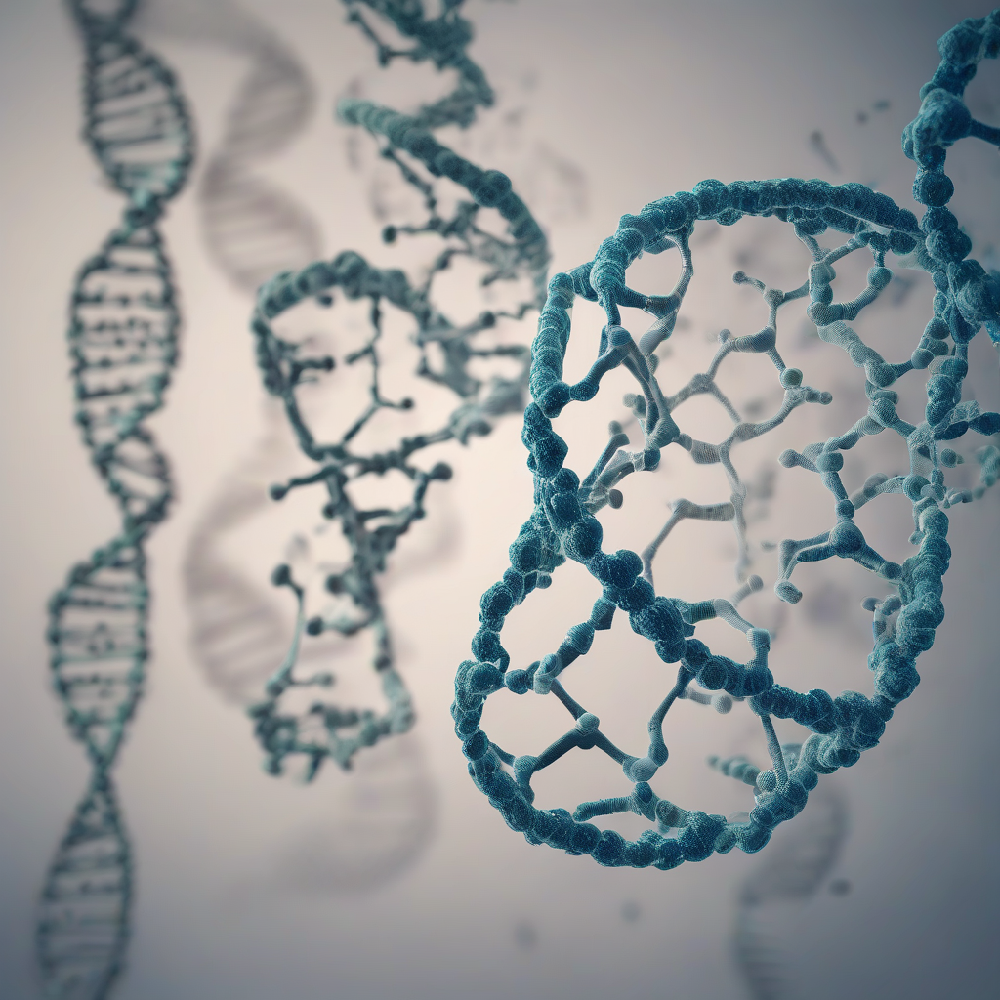

Title: "Gene Editing Breakthrough Fuels Hope for Rare Disease Cure"
Date: 2024-10-09 05:26
Category: biotech

> This article is AI generated!
> 
> Title and text are generated with @cf/meta/llama-3.1-8b-instruct
> 
> Image is generated with @cf/stabilityai/stable-diffusion-xl-base-1.0
> 
> [Check out Cloudflare Workers AI](https://developers.cloudflare.com/workers-ai/models/)

A groundbreaking discovery in the field of gene editing has sparked new optimism for the treatment of rare genetic disorders. Researchers have successfully utilized the CRISPR-Cas9 system to correct a genetic mutation responsible for a rare inherited disorder known as Batten disease. This advance has paved the way for the potential treatment of other rare diseases, which afflict a significant number of individuals worldwide. Batten disease is a devastating neurodegenerative disorder that affects approximately 2,500 children in the United States, causing severe physical and cognitive decline.