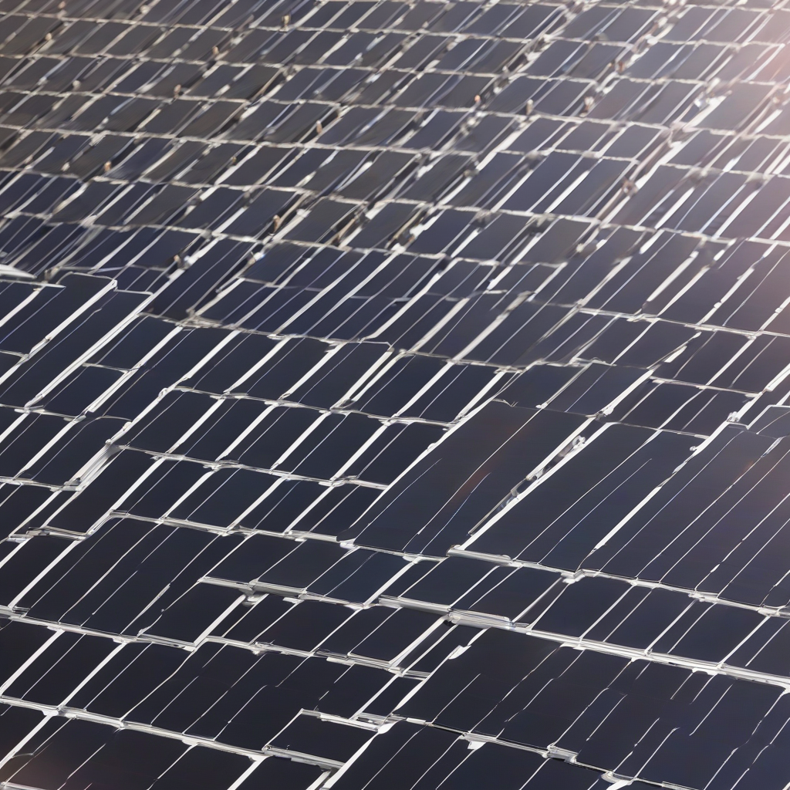

Title: "Solar Expansion Slows Amid Rising Material Costs"
Date: 2024-10-10 22:28
Category: green energy

> This article is AI generated!
> 
> Title and text are generated with @cf/meta/llama-3.1-8b-instruct
> 
> Image is generated with @cf/stabilityai/stable-diffusion-xl-base-1.0
> 
> [Check out Cloudflare Workers AI](https://developers.cloudflare.com/workers-ai/models/)

The solar industry has witnessed rapid growth over the past decade, driven by decreasing costs and increasing demand for renewable energy. However, a recent surge in material costs has slowed the expansion of solar capacity growth. According to a report by the International Energy Agency (IEA), the growth rate of solar energy capacity additions has slowed to 7% in 2022, down from 20% in 2021. This news has sparked concerns among industry experts, as the sector struggles to maintain momentum despite its critical role in reducing greenhouse gas emissions.