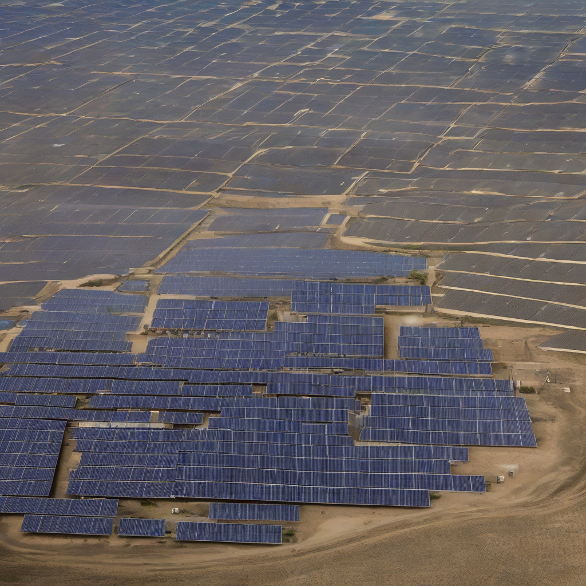

Title: "Solar Surge: New Record Set for Renewable Energy Output"
Date: 2024-10-12 17:29
Category: green energy

> This article is AI generated!
> 
> Title and text are generated with @cf/meta/llama-3.1-8b-instruct
> 
> Image is generated with @cf/stabilityai/stable-diffusion-xl-base-1.0
> 
> [Check out Cloudflare Workers AI](https://developers.cloudflare.com/workers-ai/models/)

A groundbreaking milestone has been achieved in the world of renewable energy, as solar power output has reached an unprecedented new high. According to recent data from the International Energy Agency (IEA), solar energy production has soared to a record-breaking 450 gigawatts (GW) of power, exceeding expectations and cementing solar as a leading form of clean energy. This staggering achievement marks a significant leap forward for the renewable industry, demonstrating the rapid growth and maturity of solar technology in recent years.