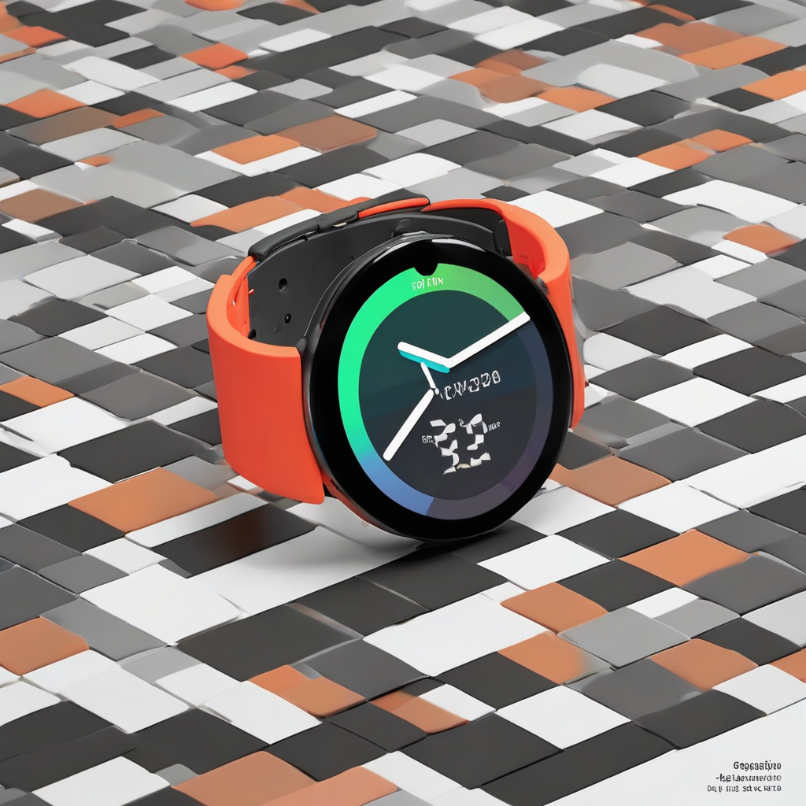

Title: "Pixel Pioneer Revolutionizes Smartwatch User Interface"
Date: 2024-10-13 05:30
Category: technology

> This article is AI generated!
> 
> Title and text are generated with @cf/meta/llama-3.1-8b-instruct
> 
> Image is generated with @cf/stabilityai/stable-diffusion-xl-base-1.0
> 
> [Check out Cloudflare Workers AI](https://developers.cloudflare.com/workers-ai/models/)

In a groundbreaking innovation, Pixel Pioneer, a renowned tech firm, has introduced a revolutionary new smartwatch user interface that is set to change the way we interact with our wearable devices. Dubbed "Echo," the sleek and User Interface (UI) is designed to provide a more seamless and intuitive experience for users. Gone are the cluttered screens and fussy menus of traditional smartwatches, replaced by a clean and futuristic interface that learns and adapts to the user's preferences and habits. With Echo, users can simply "swipe, tap, and hold" to access their most frequently used features, making it easier than ever to stay connected, track fitness goals, and receive timely updates on the go.