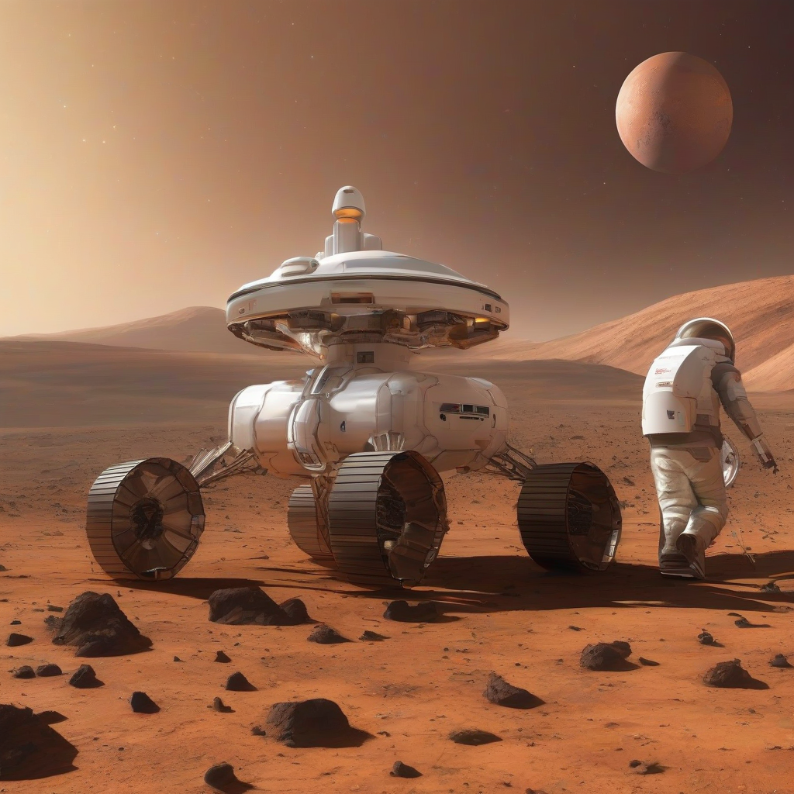

Title: "New Horizons for Mars Colonization"
Date: 2024-10-15 01:32
Category: space exploration

> This article is AI generated!
> 
> Title and text are generated with @cf/meta/llama-3.1-8b-instruct
> 
> Image is generated with @cf/stabilityai/stable-diffusion-xl-base-1.0
> 
> [Check out Cloudflare Workers AI](https://developers.cloudflare.com/workers-ai/models/)

The idea of sending humans to Mars has long been a topic of interest for space agencies and private companies alike. With significant advancements in technology and economic investments, the prospect of establishing a human settlement on the Red Planet is becoming increasingly feasible. NASA's Artemis program, for example, aims to return humans to the lunar surface by 2024 and establish a sustainable presence on the Moon. The ultimate goal is to use the Moon as a stepping stone for a manned mission to Mars, with the possibility of establishing a permanent human settlement on the Martian surface.