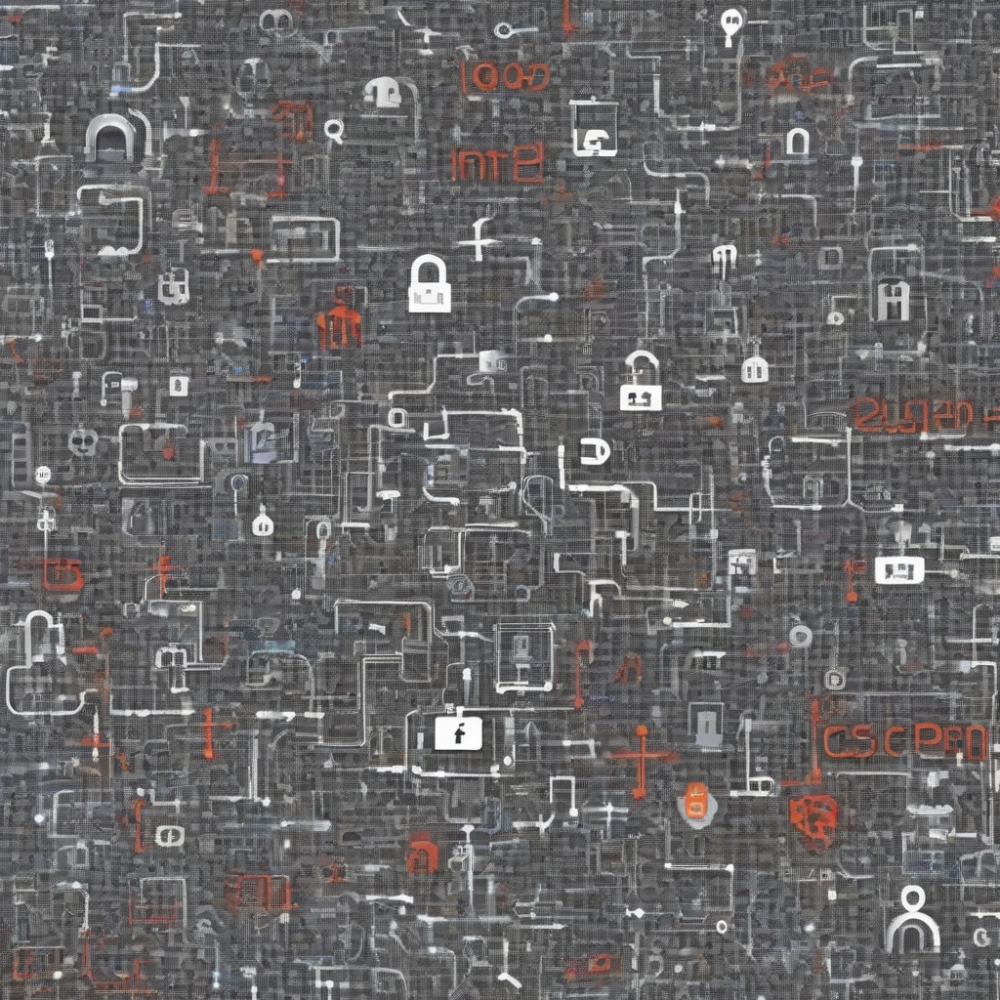

Title: "Tech Giants Unite Against Cybersecurity Threats"
Date: 2024-10-15 08:33
Category: technology

> This article is AI generated!
> 
> Title and text are generated with @cf/meta/llama-3.1-8b-instruct
> 
> Image is generated with @cf/stabilityai/stable-diffusion-xl-base-1.0
> 
> [Check out Cloudflare Workers AI](https://developers.cloudflare.com/workers-ai/models/)

The world of technology has witnessed a significant shift in recent times, with the rise of cybersecurity threats becoming a constant concern for individuals and organizations alike. In response to this growing threat, several tech giants have come together to form a united front against cyberattacks. Companies like Microsoft, Google, Apple, Amazon, and Facebook, have formed a coalition aimed at sharing information and expertise to better tackle the ever-evolving landscape of cybersecurity threats. By pooling their resources and expertise, these tech giants aim to develop more effective countermeasures to protect against malware, phishing, and other types of cyberattacks.