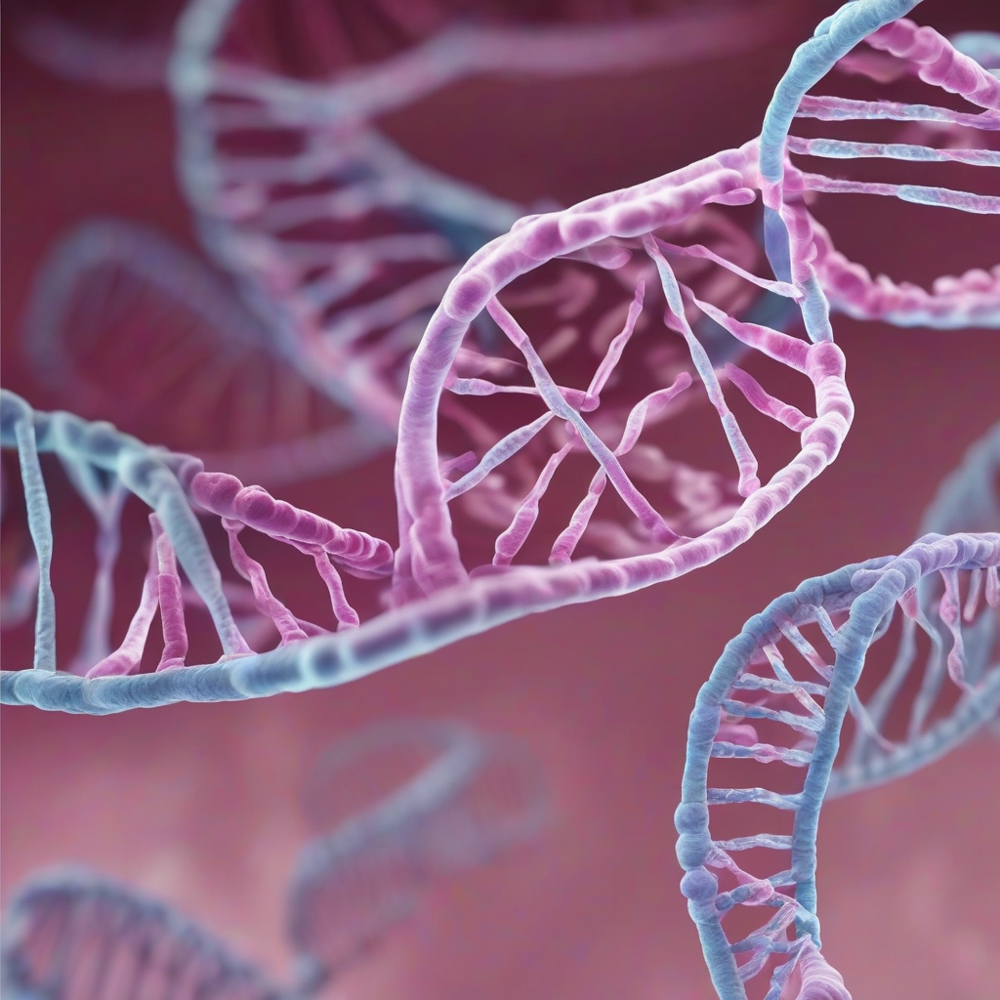

Title: "Gene Editing Breakthrough Raises Ethical Concerns"
Date: 2024-10-16 01:34
Category: biotech

> This article is AI generated!
> 
> Title and text are generated with @cf/meta/llama-3.1-8b-instruct
> 
> Image is generated with @cf/stabilityai/stable-diffusion-xl-base-1.0
> 
> [Check out Cloudflare Workers AI](https://developers.cloudflare.com/workers-ai/models/)

A recent breakthrough in gene editing technology has left the scientific community abuzz with excitement and concern. The discovery of a new method to edit genes with unprecedented precision has the potential to revolutionize the treatment of genetic diseases and disorders. However, this development has also raised a plethora of ethical concerns that require immediate attention. The use of gene editing tools such as CRISPR/Cas9 has long been hailed as a game-changer in the field of genetics, but the latest advancements have sparked debates about the potential misuse of these technologies.