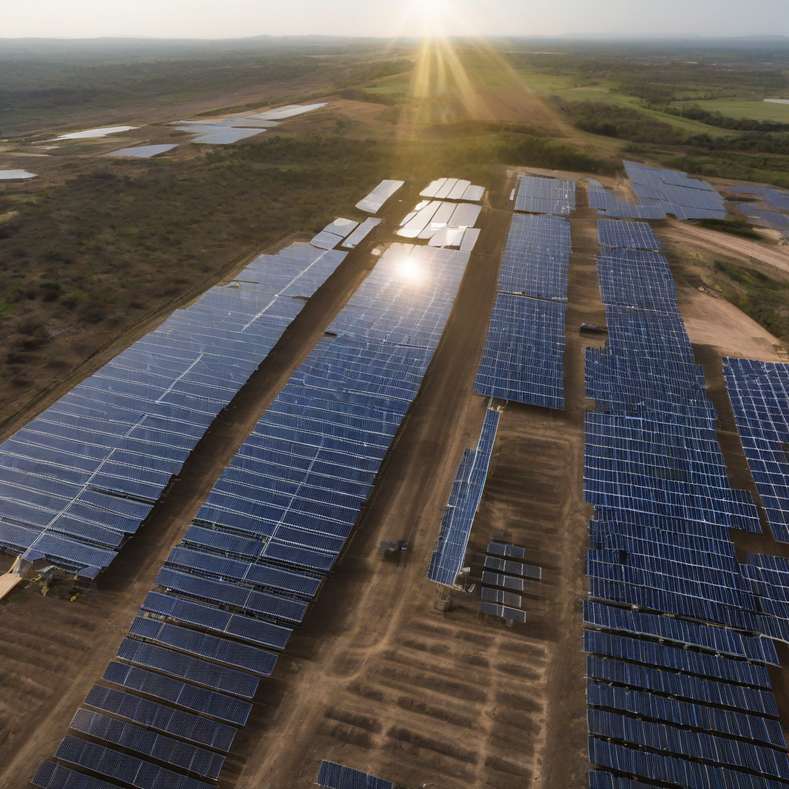

Title: "Solar Sector Sees Record Growth"
Date: 2024-10-16 12:44
Category: green energy

> This article is AI generated!
> 
> Title and text are generated with @cf/meta/llama-3.1-8b-instruct
> 
> Image is generated with @cf/stabilityai/stable-diffusion-xl-base-1.0
> 
> [Check out Cloudflare Workers AI](https://developers.cloudflare.com/workers-ai/models/)

The solar energy sector has witnessed unprecedented growth in recent years, with record-breaking installations and plummeting costs sending shockwaves throughout the industry. According to the latest figures released by the International Energy Agency (IEA), the world experienced a 21% increase in solar capacity additions in 2020, marked by a total of 139 gigawatts of new solar installations. This marked the first time solar energy reached over 700 gigawatts of global installed capacity, a significant milestone in the sector's rapid expansion.